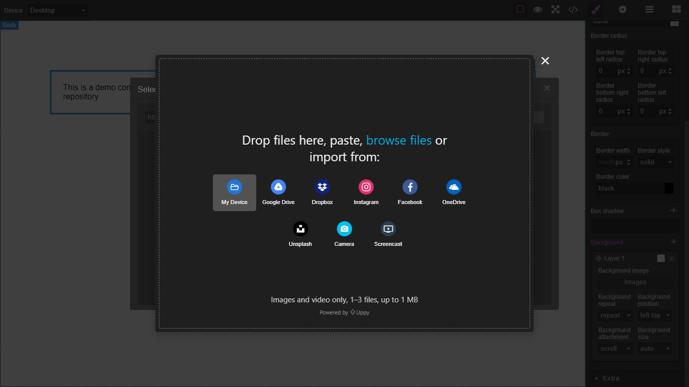

# Grapesjs Uppy

Uppy file uploader for `grapesjs`.`WIP`

> Add [companion](https://uppy.io/docs/companion) to use other image sources other than local. At the moment only [tus](https://github.com/tus/tusd) is supported for file uploads

Screenshot:


[DEMO](##)

### HTML
```html
<link href="https://unpkg.com/grapesjs/dist/css/grapes.min.css" rel="stylesheet">
<script src="https://unpkg.com/grapesjs"></script>
<link href="https://unpkg.com/grapesjs-uppy/dist/grapesjs-uppy.min.css" rel="stylesheet">
<script src="https://unpkg.com/grapesjs-uppy"></script>

<div id="gjs"></div>
```

### JS
```js
const editor = grapesjs.init({
	container: '#gjs',
  height: '100%',
  fromElement: true,
  storageManager: false,
  plugins: ['grapesjs-uppy'],
});
```

### CSS
```css
body, html {
  margin: 0;
  height: 100%;
}
```


## Summary

* Plugin name: `grapesjs-uppy`


## Options

| Option | Description | Default |
|-|-|-
| `btnEl` | Custom button element which triggers Uppy modal | ` ` |
| `btnText` | Text for the button in case the custom one is not provided | `Add images` |
| `theme` | Uppy's filepicker theme | `dark` |
| `uppyOpts` | Uppy's options | `{...}` |
| `dashboardOpts` | Uppy's dashboard options | `{...}` |
| `companionUrl` | Uppy companion url | `https://companion.uppy.io` |
| `endpoint` | Tus endpoint url | `https://tusd.tusdemo.net/files/` |
| `onComplete` | On complete upload callback | `console.log('successful files:', assets)` |
| `onFailed` | On failed upload callback | `console.log('failed files:', assets)` |
| `googledrive` | Use plugin | `false` |
| `dropbox` | Use plugin | `false` |
| `instagram` | Use plugin | `false` |
| `facebook` | Use plugin | `false` |
| `onedrive` | Use plugin | `false` |
| `unsplash` | Use plugin | `false` |
| `webcam` | Use plugin | `true` |
| `screencapture` | Use plugin | `true` |


## Download

* CDN
  * `https://unpkg.com/grapesjs-uppy`
* NPM
  * `npm i grapesjs-uppy`
* GIT
  * `git clone https://github.com/Ju99ernaut/grapesjs-uppy.git`


## Usage

Directly in the browser
```html
<link href="https://unpkg.com/grapesjs/dist/css/grapes.min.css" rel="stylesheet"/>
<link href="https://unpkg.com/grapesjs-uppy/dist/grapesjs-uppy.min.css" rel="stylesheet">
<script src="https://unpkg.com/grapesjs"></script>
<script src="path/to/grapesjs-uppy.min.js"></script>

<div id="gjs"></div>

<script type="text/javascript">
  var editor = grapesjs.init({
      container: '#gjs',
      // ...
      plugins: ['grapesjs-uppy'],
      pluginsOpts: {
        'grapesjs-uppy': { /* options */ }
      }
  });
</script>
```

Modern javascript
```js
import grapesjs from 'grapesjs';
import plugin from 'grapesjs-uppy';
import 'grapesjs/dist/css/grapes.min.css';
import 'grapesjs-uppy/dist/grapesjs-uppy.min.css';

const editor = grapesjs.init({
  container : '#gjs',
  // ...
  plugins: [plugin],
  pluginsOpts: {
    [plugin]: { /* options */ }
  }
  // or
  plugins: [
    editor => plugin(editor, { /* options */ }),
  ],
});
```


## Development

Clone the repository

```sh
$ git clone https://github.com/Ju99ernaut/grapesjs-uppy.git
$ cd grapesjs-uppy
```

Install dependencies

```sh
$ npm i
```

Build css

```sh
$ npm run build:css
```

Start the dev server

```sh
$ npm start
```

Build the source

```sh
$ npm run build
```


## License

MIT
